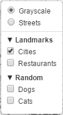
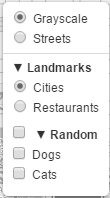

Leaflet.groupedlayercontrol
===========================

Leaflet layer control with support for grouping overlays together.
Also supports making groups exclusive (radio instead of checkbox).



Demos: [Basic](http://tsrman.github.io/Leaflet.groupedlayercontrol/example/basic.html) |
[Advanced](http://tsrman.github.io/Leaflet.groupedlayercontrol/example/advanced.html)

## Usage

### Initialization

Add groupings to your overlay layers object, and swap out the default layer
control with the new one.

```javascript
var groupedOverlays = {
  "Landmarks": {
    "Motorways": motorways,
    "Cities": cities
  },
  "Points of Interest": {
    "Restaurants": restaurants
  }
};

L.control.groupedLayers(baseLayers, groupedOverlays).addTo(map);
```

### Advanced usage

For added functionality, pass options when creating the layer control.

```javascript
var options = {
  // Make the "Landmarks" group exclusive (use radio inputs)
  exclusiveGroups: ["Landmarks"],
  // Show a checkbox for this groups
  groupCheckboxes: ["Random"]
};

L.control.groupedLayers(baseLayers, groupedOverlays, options).addTo(map);
```



### Adding a layer

Adding a layer individually works similarly to the default layer control,
except that you can also specify a group name, along with the layer and layer name.

```javascript
layerControl.addOverlay(cities, "Cities", "Landmarks").
```

## Note

This plugin only affects how the layers are displayed in the layer control,
and not how they are rendered or layered on the map.

Grouping base layers is not currently supported, but adding exclusive layer
groups is. Layers in an exclusive layer group render as radio inputs.

## License

Leaflet.groupedlayercontrol is free software, and may be redistributed under
the MIT-LICENSE.
